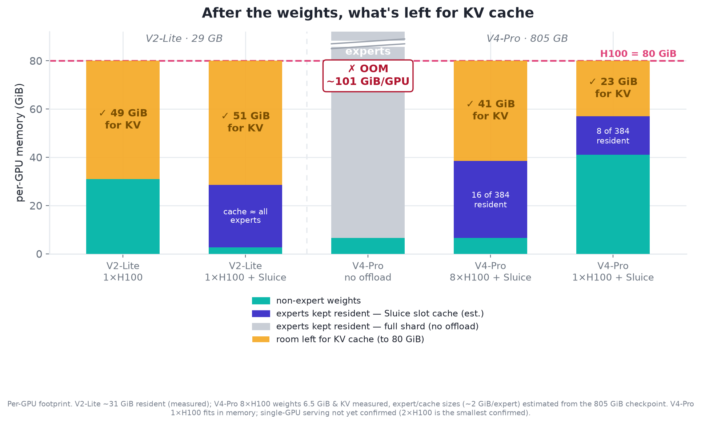
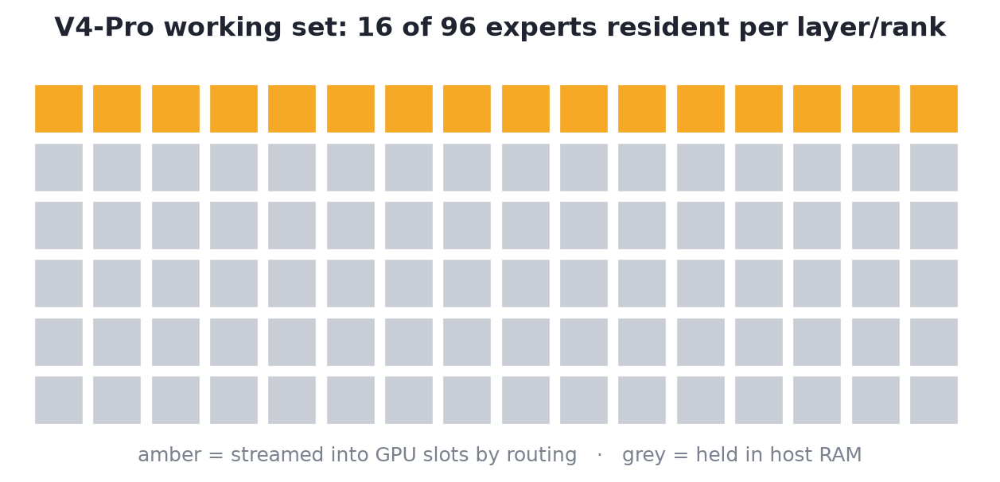
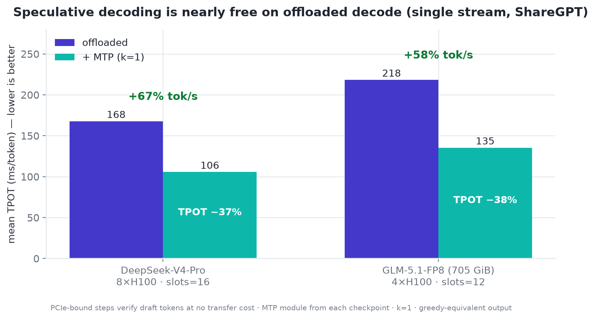
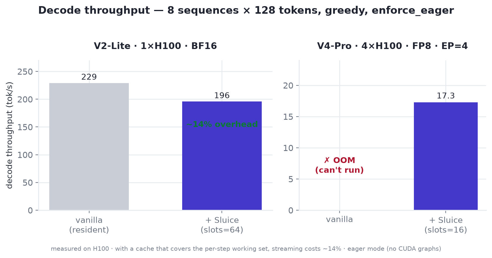
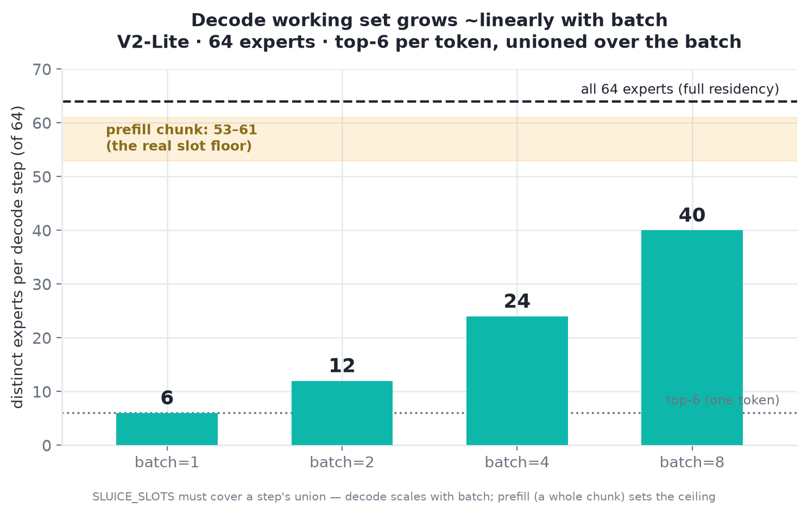
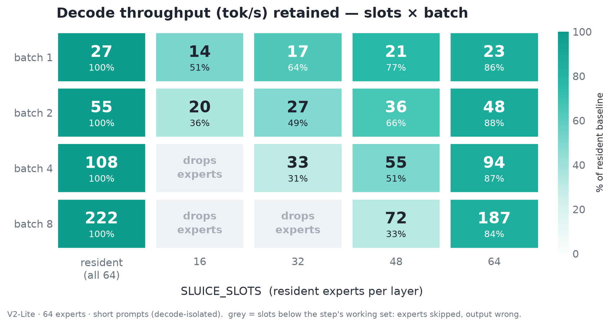

<p align="center">
  
</p>

<h1 align="center">Sluice</h1>

<p align="center">
  <b>Routing-aware MoE expert offloading for vLLM</b> — a plugin, not a fork.
</p>

<p align="center">
  Run Mixture-of-Experts models whose experts exceed GPU memory — like
  <b>DeepSeek-V4</b> — by keeping experts in host RAM and streaming only the
  router's picks into a small per-layer GPU cache each step.
</p>

<p align="center"></p>

## Quickstart

```bash
pip install -e .          # into an environment that already has vLLM
SLUICE_SLOTS=16 python examples/run_dsv4_ep4.py
```

`SLUICE_SLOTS` = resident experts per layer, per rank. Unset → Sluice is inert.

## Results

Stock vLLM, no fork. **V2-Lite** offloaded output is **bit-identical** to the
resident baseline (greedy, token ids). **V4-Pro** (FP8, EP=4) loads with just
**9.49 GiB** of GPU weights and answers correctly:

> *The capital of France is* → **Paris. The capital of Germany is Berlin. The capital of Italy is Rome. The capital of Japan is Tokyo.**

<p align="center"></p>

Streaming experts on demand costs only **~14%** throughput vs keeping them all
resident (when the cache covers the per-step [working set](#sizing-the-cache)) —
and lets V4-Pro serve at all, where it otherwise OOMs.

Offloaded decode is PCIe-bound, so speculative decoding verifies extra tokens
for free: with the checkpoint's own **MTP** module (`deepseek_mtp`, k=1),
single-stream decode goes **4.9 → 8.2 tok/s (+67%, TPOT 168 → 106 ms)** on
natural text, +48% at concurrency 4 — and the physics replicates on GLM-5.1
(+58%; see
[EVALUATION.md](docs/EVALUATION.md#speculative-decoding-mtp--offload--the-latency-regime-lever)).

<p align="center"></p>

<p align="center"></p>

## Sizing the cache

`SLUICE_SLOTS` must be ≥ the **distinct experts selected in one forward step** —
set by the step's token count, not `top_k`. Each token picks `top_k`, but a step
unions them: decode grows ~linearly with batch, and **prefill** (a whole chunk)
sets the ceiling. Measured on V2-Lite (64 experts, top-6, one H100):

<p align="center"></p>

Below a step's working set the step executes in **waves** (multiple kernel
launches, partials summed in fp32) — always exact in math, but slower per wave;
more slots means fewer waves and fewer misses. Covering the working set isn't
free either: experts still stream CPU→GPU each step, so throughput drops the
further you are below full residency, more so at larger batches (larger working
set):

<p align="center"></p>

Size slots to the prefill working set, or cap it with a smaller
`--max-num-batched-tokens`. Expert parallelism shards experts per rank, so the
per-rank per-step set stays small and `slots ≪ experts` holds (V4-Pro serves at
16 of 96 per rank); on one unsharded GPU the prefill set approaches all experts.

## Deploy DeepSeek-V4

```bash
SLUICE_SLOTS=16 vllm serve deepseek-ai/DeepSeek-V4-Pro \
  --tensor-parallel-size 4 --enable-expert-parallel \
  --moe-backend marlin --kv-cache-dtype fp8 \
  --gpu-memory-utilization 0.45 --enforce-eager --trust-remote-code
```

Needs an `expert_map`-honoring backend (`marlin` / `triton`, **not** FlashInfer);
the low `--gpu-memory-utilization` leaves VRAM for the slot caches. Design,
load/forward paths, and the gotchas: **[docs/ARCHITECTURE.md](docs/ARCHITECTURE.md)**.

## Compared to other engines

We loaded the **stock V4-Pro FP8 checkpoint** (~805 GiB) on one **4×H100** box (320 GiB) with each engine:

| Engine | Expert compute | On 4×H100, stock FP8 checkpoint |
|---|---|---|
| **Sluice** (vLLM) | GPU (streamed) | ✅ **runs · ~17 tok/s** |
| stock vLLM | GPU | ❌ **OOM** (verified) |
| SGLang | GPU | ❌ **OOM** (verified) |
| KTransformers · llama.cpp | CPU | ⚠️ need their own weight format (KT / GGUF) |

GPU-resident engines can't fit V4's experts (805 GiB ≫ 320, and ≫ 640 GiB on
8×H100). KTransformers and llama.cpp *can* offload, but compute experts on **CPU**
and need converted weights. Sluice is the only one that streams experts onto the
**GPU inside vLLM's serving stack**. [Full comparison + sources →](docs/COMPARISON.md)

---

<p align="center">
  Apache-2.0 · built on <a href="https://github.com/vllm-project/vllm">vLLM</a> ·
  <a href="docs/ARCHITECTURE.md">Architecture</a> ·
  <a href="docs/COMPARISON.md">Comparison</a> ·
  <a href="CONTRIBUTING.md">Contributing</a>
</p>
