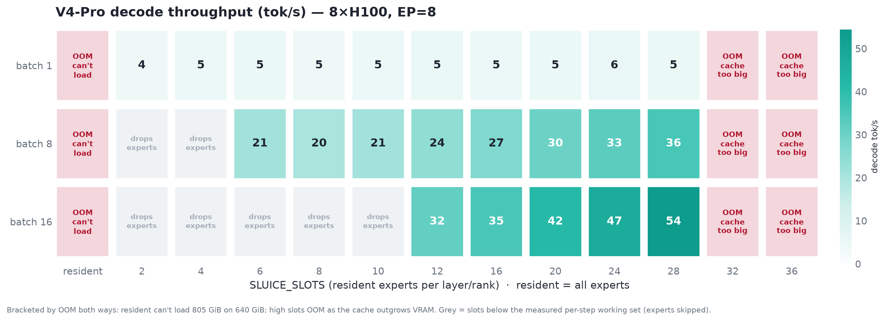
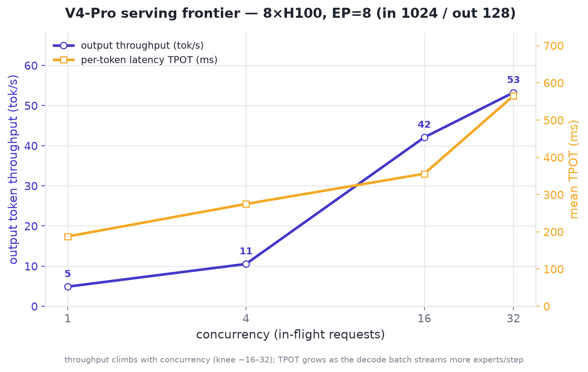
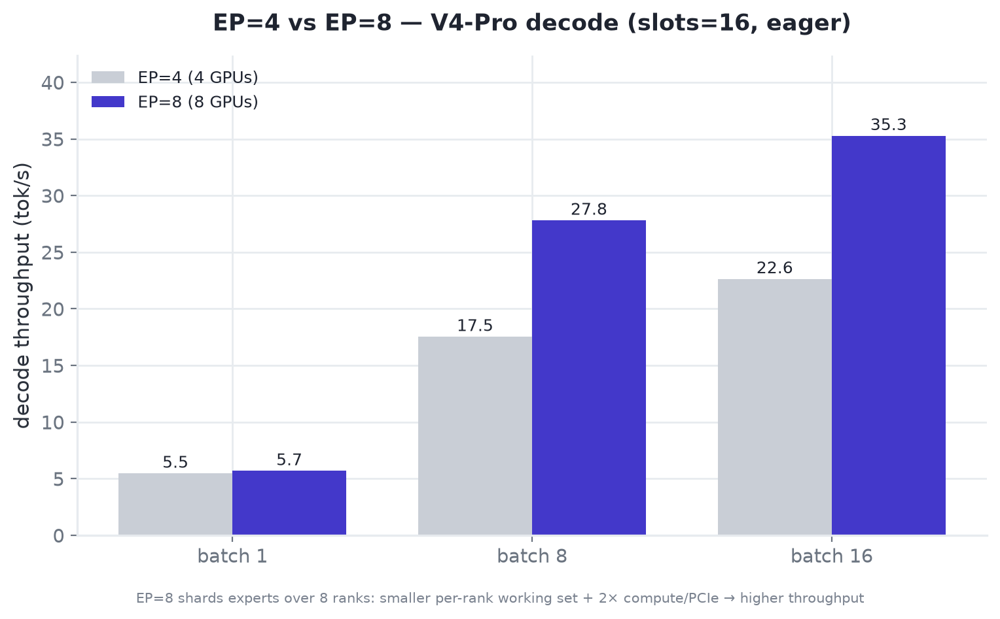
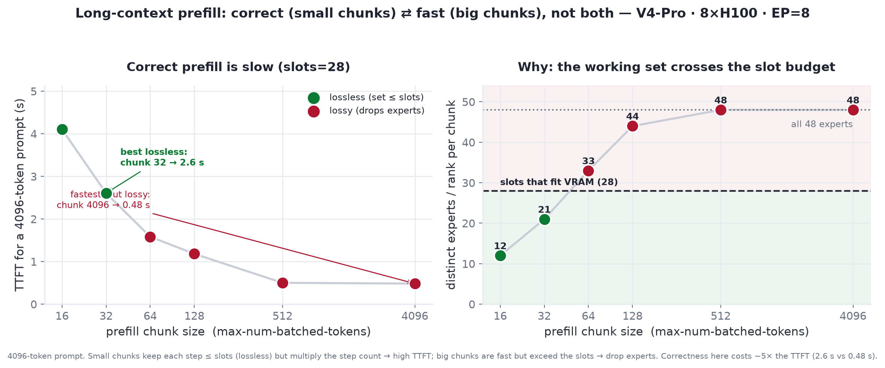

# Evaluating Sluice on 8×H100

A plan to decide one question: **is Sluice effective enough to serve
DeepSeek-V4-Pro in production on a single 8×H100 node?**

This document is written for that decision. The headline (can it run, and what
does it cost) is up front; correctness and performance rigor back it up; the
methodology and caveats are in the appendix. For how Sluice works see
[ARCHITECTURE.md](ARCHITECTURE.md); for how it compares to other engines see
[COMPARISON.md](COMPARISON.md).

## The headline

DeepSeek-V4-Pro (FP8) is **~805 GiB** of weights, almost all experts. A full
8×H100 node is **640 GiB**. So the model **does not fit GPU-resident even on a
maxed-out node** — stock vLLM and SGLang OOM at load, and "just add GPUs" means
a *second node*. Sluice keeps the experts in host RAM and streams only the
router's picks into a small GPU cache each step, so the model **serves on one
node, inside vLLM**, trading some throughput to fit.

The evaluation proves three things, in priority order:

1. **It runs where nothing else does** on a single node (capability).
2. **What it costs** per token vs. the alternatives (economics).
3. **It is correct, and the cost is predictable** (trust).

> **Why 8×H100 is the right venue.** At 640 GiB nobody can wave the result away
> with "use more GPUs" — you are already at a full node. And with expert
> parallelism across 8 ranks (EP=8) the per-rank expert shard **halves** vs the
> 4×H100 result we already have (~191 → ~95 GiB), local experts per rank drop
> ~96 → ~48, and far more GPU cache slots fit — so 8×H100 is where Sluice should
> look its best, not just where it barely fits.

## Measured results — 8×H100, 2026-06-28

Run on one IBM OpenShift 8×H100-80GB node (~2 TB host RAM), stock
`vllm/vllm-openai:v0.23.0`, Sluice installed as the plugin (no fork). **The
headline holds: on a single full node, stock vLLM cannot load V4-Pro; Sluice
serves it.**

| Hypothesis | Result |
|---|---|
| **H1 Capability** (V4-Pro, TP=8/EP=8) | **stock vLLM → OOM** (every GPU fills to 79.2 GiB; `torch.OutOfMemoryError`, 20 MiB free). **Sluice → serves**: 6.54 GiB weights on GPU + 27.2 GiB KV (52,247 tokens); correct output (`"… is Paris."`). |
| **V4-Pro throughput** (EP=8, slots=16, eager) | 5.7 tok/s @ batch 1 · 27.8 @ batch 8 · 35.3 @ batch 16 |
| **H2 Correctness** (V2-Lite, slots=64) | Sluice vs resident → **bit-identical** token ids |
| **H3 Decode overhead** (V2-Lite, slots=64) | **~10% overhead** — 89–92% of resident across batch 1–8 (resident 27.9/55.6/109/220 tok/s) |
| **Working-set floor** (V2-Lite, from the sweep) | bit-exact needs slots ≥ 6/12/24/48 at batch 1/2/4/8; below it the cache drops experts (`correct=0`) — the correctness knob, reproduced |
| **Serving frontier** (H5, EP=8, in1024/out128) | output throughput **4.9 → 53.2 tok/s** as concurrency 1 → 32 (total 44 → 479 tok/s); TPOT 188 → 565 ms; knee ~16–32 |
| **EP=4 vs EP=8** (H4, decode, slots=16) | batch 8: 17.5 → **27.8** tok/s (1.6×); batch 16: 22.6 → **35.3** (1.6×); batch 1 ~equal (latency-bound). EP=8 wins **absolute** throughput; EP=4 wins **tokens/s/GPU** |
| **V4-Pro slots × batch** (EP=8) | bracketed by OOM **both ways** — resident can't load (805 > 640), and slots ≥ 32 OOM (cache > VRAM @ gpu_mem 0.2). Between, throughput rises with slots (batch 16: **32 → 54 tok/s** for slots 12 → 28); slots below the per-rank working set (~1/6/12 at batch 1/8/16) drop experts. Fast-but-invalid corner: slots=2/batch 16 is the *highest* raw number (61) because it skips most experts |
| **Prefill — correct⇄fast** (EP=8) | a prefill chunk hits ~all experts fast (256 tokens → all 48/rank ≫ 28 slots), so big chunks **drop experts**. Capping the chunk makes it **lossless but slow**: a 4096-token prompt costs **2.6 s lossless (chunk 32)** vs **0.48 s lossy (chunk 4096)** — **~5× for correctness**. `slots ≪ experts` is a *decode* win; **prefill can't be both fast and correct** — *first-cut only; superseded by waves (see [Optimization](#optimization-waves--scan-resistant-cache-prefilldecode-aware)), which make any chunk size lossless* |

## Optimization: waves + scan-resistant cache (prefill/decode aware)

The numbers above are the *first-cut* offloader (single kernel launch per step,
plain LRU). Profiling the serving path exposed three structural costs, each
fixed and re-measured on the same 8×H100 node:

1. **Correctness cliff → waves.** A single launch reads one expert map, so a
   step selecting more experts than slots silently *dropped* the excess
   (`correct=0`). The offloader now partitions a step's experts into **waves**
   that each fit the cache and sums the partial outputs (exact: an unmapped
   expert contributes zero, exactly as EP ranks skip remote experts; partials
   summed in fp32). Any positive slot count is now **correct** — prefill no
   longer has to choose between fast and lossless. The old "**~5× for
   correctness**" prefill tradeoff is gone: a big chunk is streamed in waves,
   not dropped.
2. **Chunked-prefill eviction → SLRU + step-type policy.** vLLM v1 mixes
   prefill and decode in one batch; a prefill chunk touches ~all experts and,
   under LRU, evicted the decode-hot set every step. The cache is now **SLRU**
   with a protected segment; decode-selected experts (identified from the v1
   forward-context `num_decode_tokens`) are protected while prefill/scan
   experts are confined to probation, so a scan can no longer flush the decode
   set.
3. **Serialized fills → dedicated copy stream.** Multi-wave fills overlap the
   previous wave's compute on a separate H2D stream, event-fenced.

**Serving A/B — V4-Pro, EP=8, slots=16, marlin, fp8 KV, in1024/out128**
(paired, back-to-back, first-cut vs optimized):

| Concurrency | Output tok/s (before → after) | Mean TPOT ms (before → after) |
|---|---|---|
| 4  | 17.3 → **20.2**  (+16%) | 211 → **167**  (−21%) |
| 16 | 43.6 → **64.4**  (+48%) | 349 → **222**  (−36%) |
| 32 | 56.0 → **80.6**  (+44%) | 534 → **350**  (−34%) |

The win grows with concurrency — more interleaved prefill/decode means more
decode-set eviction for the SLRU policy to prevent. Decode-only throughput at
full residency is unchanged (~92% of resident on V2-Lite); the gain is on the
mixed serving path, which is what production runs.

### What did *not* help (measured, so we don't relitigate)

- **Gate-ahead prefetch** (stream next-step picks during this step): neutral on
  pure decode — last-step selections are *already resident*, so the misses are
  the router's genuinely new picks, which history can't predict — and slightly
  negative under serving load (steals PCIe from demand misses). Removed.
- **Zero-sync** (launch against a standing all-resident map, read routing
  async, patch misses): **~7× slower** at full residency and wrong output —
  the standing map never pre-warms, so every step bootstraps through degenerate
  delta thrashing, and the async readback still stalls the CPU. Abandoned.
- **LFU / popularity pinning** (protect the most-used experts): within noise
  (±2%). DeepSeek trains for **balanced** expert utilization (aux-loss-free
  load balancing), so there is almost no popularity skew to exploit — unlike
  the older skewed MoEs the caching literature targets. Kept as an opt-in
  (`SLUICE_LFU=1`) for skewed models; off by default.
- **Larger `--max-num-batched-tokens`** (8192): no help at in=1024 (a request
  already fits one chunk), and waves already make large chunks correct.

**Remaining ceiling.** Below full residency, decode is **PCIe-bound**: bytes
streamed per step = misses × expert size, and at ~50 GB/s that sets a hard
floor no cache policy can beat (V2-Lite b8/s24 is already near it). The only
levers left are *fewer bytes* (a quantized streaming tier) or *CPU compute*
for the cold tail — both larger, accuracy-sensitive projects.

**Quantized streaming tier — measured no-go for the FP8 production path.** The
tier would help only these PCIe-bound cells, and only by halving bytes/miss.
But V4-Pro experts are *already* 8-bit (the checkpoint stores int8 codes with
block-16 scales), so the only byte-saving option is a *second* quantization to
int4. Measured on real V4-Pro expert tensors (45 expert-weights across layers
0/5/15/30/45), uniform int4 group-128 reconstruction of the dequantized weights
gives **8.4% mean relative error** (w1 8.38%, w2 8.38%, w3 8.34%) vs **0.43%**
for int8 — 3–8× the 1–3% that int4-from-BF16 achieves, the double-quantization
penalty. 8.4% weight error is well past a <1% task-quality bar, and int8 saves
nothing on an already-8-bit model. **The outlier-aware escape hatch is now
also measured closed**: protecting the top-10% input channels exactly (kept
in FP8) drops error only to **7.9–8.0%** (row-wise grouping and group-64
are similarly marginal: 8.1–8.4% across w1/w2/w3, 45 tensors) — the int4
error on block-scaled-FP8 weights is uniformly distributed across channels,
not outlier-concentrated, because the FP8 block scaling already flattened
the structure AWQ-class schemes exploit. Double quantization is structural
here, not fixable by channel selection. It remains viable only for *unquantized* (BF16) experts, where
BF16→int8 is a single near-lossless step (~1.65× on V2-Lite b8/s24) — but those
models are not the offloading target. Net: below-residency decode throughput is
a hard PCIe floor for quantized MoE; Sluice's win is **capability** (serving
models that OOM) plus the **serving-path** gains above, not below-residency
decode speed.

**CPU compute of cold experts — measured no-go on datacenter Gen5.** The other
way to dodge the PCIe transfer is to *compute* a missing expert on the CPU
(Fiddler-style) instead of streaming it. Microbenched on the node (224-core,
AMX-capable): a V4-Pro (expert, layer) is 33 MB, so the PCIe Gen5 transfer it
would replace is only **0.66 ms**. CPU forward for that expert at decode token
counts is **3–33 ms (bf16)** — 5–50× slower — because the CPU floor is set by
reading the weight from DRAM (66 MB as bf16, since no CPU FP8/block-scaled-int8
GEMM exists) at 45–90 GB/s *per rank* (worse under 8-way co-residency), i.e.
0.7–1.5 ms just to read, before compute, vs a 0.66 ms transfer. Fiddler's win
was real on *consumer* PCIe (a 340 MB BF16 Mixtral expert = ~28 ms transfer, a
high bar); Gen5 + FP8 shrank the bar ~40× while the CPU floor held, erasing it.
The one datacenter paper on this exact setup (CoX-MoE, H100+Gen5) concurs — the
value shifts *away* from CPU-expert-compute as the GPU gets faster. It would
only flip with per-channel int8 experts exported for AMX-INT8 (a different
checkpoint pipeline), not the production FP8 path.

**Levers explored, with evidence.** waves (ship), SLRU + prefill/decode policy
(ship), copy-stream overlap (ship) · gate-ahead prefetch (neutral/negative),
zero-sync (7× slower + wrong), LFU pinning (no skew on balanced MoE),
int4 stream tier (8.4% weight error), CPU-compute (Gen5 too fast) — all
measured, all closed. The optimization frontier for quantized offloaded MoE is
mapped: the wins are capability and the serving path; below-residency decode is
a fundamental PCIe floor.

### Phase-specialized round: prefill + decode

A second pass targeting each phase directly.

**Decode — static full map (D1): recovers the routing-hook floor.** At full
residency (`slots ≥ local experts`, e.g. a high-EP rank whose shard fits) the
per-layer hook — the `topk_ids` D2H sync, `torch.unique`, and expert-map
rewrite — is pure overhead: the map is the identity and never changes. Detecting
that case at load, preloading the shard, and skipping the hook makes decode
behave exactly like a resident EP rank. **Measured (V2-Lite, slots=64):
bit-identical output, decode 90% → 98–101% of resident.** Zero risk; shipped.

**Prefill — the win is one big chunk, not clever streaming.** The design pass
first *refuted* cross-layer expert prefetch by arithmetic: prefill is
stream-bound by 77–193× (each layer needs ~all experts; compute is far too
short to hide the transfer), so no overlap scheme can pierce the bytes/BW floor.
What *does* move TTFT is chunk size, because waves made large chunks lossless —
a big chunk streams each expert once instead of re-streaming the shard per tiny
chunk. **Measured (V4-Pro, EP=8, slots=16, 4096-token prompt, lossless):**

| `--max-num-batched-tokens` | 64 | 512 | 4096 |
|---|---|---|---|
| prefill TTFT | 2068 ms | **730 ms** | 748 ms |

A ~2.8× drop from tiny to moderate chunks, saturating by ~512. The first-cut was
*forced* to tiny chunks (~2.6 s) to stay lossless; waves unlock the fast regime
(≈0.73 s) while staying bit-exact. So the prefill guidance is simply: **size
`--max-num-batched-tokens` to the prompt** — the earlier "no help" result was for
1024-token inputs that already fit one chunk. Copy-coalescing (streaming the
shard in contiguous blocks, `SLUICE_PREFILL_BLOCKS`) added nothing on top
(V4-Pro 737 vs 758 ms, within noise; neutral on V2-Lite) — kept as an
opt-in-off flag.

### Generalization beyond DeepSeek

Sluice's hook is **architecture-agnostic by construction**: it wraps
`FusedMoE.quant_method.apply` and rewrites `layer.expert_map` (global expert id
-> resident slot), a mechanism every vLLM MoE model shares — nothing in the
offloader is DeepSeek-specific. Confirmed in vLLM 0.23 source that the experts
of DeepSeek (`deepseek_v2`/`v3`), GLM (`glm4_moe`, 128 experts / top-8), and
Qwen (`qwen2_moe`, `qwen3_moe`) are all built as `FusedMoE` with
`expert_map` / `update_expert_map`, so the offloader attaches to each with no
per-architecture code. Runtime-validated end-to-end on **two families**: DeepSeek (V2-Lite bit-exact,
V4-Pro served at EP=8) and **Qwen** (Qwen1.5-MoE-A2.7B, `qwen2_moe`, 60 experts
/ top-4). On Qwen the offloader attached with no code change and was
**bit-identical to the resident baseline at both full residency (`slots=60`) and
offload (`slots=30`)** — same 24-token greedy hashes across all three. **GLM is
now runtime-validated too**: GLM-4.5-Air (`glm4_moe`, 106B, 128 experts /
top-8, bf16, TP=4/EP=4) is **bit-identical to resident at full residency
(slots=32) and identical at offload (slots=12 — eviction plus prefill
waves)**, again with zero per-architecture code. All three MoE families are
validated end-to-end. (Full-residency sizing note: the slot cache at
`slots=local_n` is the whole per-rank expert shard — GLM-4.5-Air needed
`gpu_memory_utilization` 0.28 at TP=4, vs 0.50 for slots=12.)

**The capability and sizing results replicate on GLM at both scales:**

- **GLM-5.1-FP8 (705 GiB checkpoint), 4×H100**: stock vLLM **OOMs during
  load** (320 GiB total VRAM); **Sluice serves it** (slots=8, util 0.25 —
  a deliberately conservative floor config) with correct greedy output and
  a clean 64/64 serving run (14.0 tok/s @ c16, TPOT 1.08 s, untuned — the
  KV-vs-slots rule applies for tuning). Second model family where Sluice
  turns "cannot load" into "serves".
- **KV-vs-slots on GLM-4.5-Air (bf16, TP=4/EP=4, c16)**: the rule
  generalizes with far more headroom than on FP8 DeepSeek —
  slots=20 @ util 0.35 hits **88.3 tok/s (TPOT 171 ms)** vs 32.4
  (TPOT 474 ms) for slots=12 @ 0.50: **2.7×** from the same VRAM
  reallocation, because bf16 misses cost twice the PCIe bytes and the
  config sits on the steep part of the residency curve. Resident
  reference: 226.5 tok/s (the model fits on 4 GPUs; GLM-4.5-Air is the
  correctness/sizing vehicle, not the capability target).

**Operational note — set a lower `gpu_memory_utilization` than resident.** The
slot cache and map buffers are allocated in the offloader's `post_init`, *after*
vLLM's memory profiler has already sized the KV cache to the utilization target,
so at a high value (e.g. 0.85) KV allocation OOMs even though the same model
loads resident. This is why the V4-Pro eval uses `0.55`; Qwen-MoE needed `~0.45`
on one GPU. Size the target to leave room for the slot cache — on V4-Pro each
slot costs **~1.8 GiB per rank** (61 MoE layers × ~30 MB marlin-packed expert),
so every 6 extra slots needs the utilization dropped by ~0.14.

**Spend surplus KV on slots — measured +15–20% at c16.** The utilization knob
is really a KV-vs-slots split: KV beyond what the workload's concurrent tokens
need does nothing, while every slot raises hit rate on the PCIe-bound path.
Same-pod sweep (V4-Pro EP=8, c16, in1024/out128, 4096 ctx, 80 GiB):

| Config | KV capacity | Output tok/s | Mean TPOT |
|---|---|---|---|
| slots=16 @ util 0.55 | 62.5k tok | 54.8–57.0 | ~237 ms |
| slots=22 @ util 0.40 | 39.2k | 62.9 | 212 ms |
| slots=25 @ util 0.30 | 23.6k | **67.0** | **199 ms** |

Rule: size utilization so KV ≈ 1.5–2× the peak concurrent-token demand
(`max_concurrency × (input+output)`), then give every remaining GiB to
`SLUICE_SLOTS`. slots=28 was infeasible here (KV would fall below the c16
demand); at slots=25 the KV margin is 1.28× — tight for bursty traffic, so
slots=22 @ 0.40 is the balanced choice for this shape.

The rule holds at long context and a second topology: at 16k max-len
(in4096/out256, TP=4/EP=4), slots=22 @ 0.40 beats slots=16 @ 0.55 by **+9%
tok/s (TPOT −11%) at c4 and +20% (TPOT −17%) at c8**, with zero KV
preemptions.

## Speculative decoding (MTP) × offload — the latency-regime lever

Below full residency, a decode step's cost is set by the PCIe transfer of the
missed experts, not by compute. Speculative decoding changes the *units*: a
step that verifies `1 + k` tokens streams roughly the same bytes as a 1-token
step, so every accepted draft token multiplies tokens-per-byte on the bound
resource. Measured on V4-Pro (EP=8, slots=16, marlin, fp8 KV, `deepseek_mtp`,
the checkpoint's own MTP module, k=1):

- **The verification really is free.** On random-token prompts (acceptance
  floor: mean accepted length ~1.05, drafts of noise), c1 TPOT was **160.84 ms
  with MTP vs 160.74 ms without** — verifying 2 tokens/step costs nothing at
  the transfer-bound point. Overhead appears only with concurrency (c4 +7.7%,
  c16 +61%, where draft-layer expert streaming contends for PCIe), putting
  break-even acceptance at ~1.01 (c1), ~1.08 (c4), ~1.61 (c16).
- **On natural text (ShareGPT, output 128) the win is large where offload
  hurts most:**

  | Concurrency | Offloaded (tok/s / TPOT) | + MTP k=1 | Δ output tok/s |
  |---|---|---|---|
  | 1  | 4.92 / 168 ms  | **8.22 / 106 ms**  | **+67%** |
  | 4  | 18.0 / 175 ms  | **26.6 / 134 ms**  | **+48%** |
  | 16 | 39.8 / 378 ms  | 42.5 / 351 ms      | +7% |

  Acceptance ran 56–74% per position (mean accepted length ~1.7) — right at
  the c16 break-even, comfortably past it at c1–c4.
- **k=2** (the single MTP layer applied twice): position-2 acceptance decays to
  ~0.26–0.30, and across two independent prompt samples k=2 landed **within
  sample variance of k=1** (c1: 8.6–9.8 tok/s vs 8.2; c4: 25.3–28.6 vs 26.6;
  same-sample plain baseline 5.54). Both are ~1.6–2.0× plain at c1. Guidance:
  **k=1 by default in the latency regime (c ≲ 8); k=2 is upside on predictable
  text; disable MTP at high concurrency** where drafting contends with demand
  misses.
- **Cache-policy interaction (fixed).** Under spec decode every decode request
  contributes `1 + k` tokens, which the short-extend guard would misread as
  prefill and force-scan — disabling protected-set promotion exactly when MTP
  runs. The pure-decode gate now accepts `num_decode_tokens == num_decodes ×
  (1 + k)` (k from `speculative_config`); DIAG confirms decode steps under MTP
  keep the same hit profile as without (74% vs 77% hit, 1.00 waves/step).
- Outputs under MTP match the plain server on natural-text greedy completions
  (modulo the documented multi-wave near-tie flips); spec decode's rejection
  rule preserves the target distribution, and the target model here is the
  offloaded one.

## Limits & red-team caveats

An adversarial review surfaced places the results above overstated what was
measured, plus robustness gaps. Each is now resolved in code and re-verified on
the cluster; stated honestly:

- **What the serving win actually is: scan-resistance, not decode promotion.**
  The classifier that reads `num_decode_tokens` exists only on MLA backends
  (DeepSeek). But a follow-up A/B showed the +44–48% win's true source is the
  SLRU *probation confinement* (a prefill scan can't evict the protected set),
  which the non-MLA working-set heuristic already provides — exact decode
  *promotion* helps only when the decode working set fits the protected segment
  (V4-Pro's EP=8 per-rank regime); when decode-ws ≥ slots it is pure overhead.
  On Qwen (balanced routing, no stable decode-hot set — cf. the LFU ±2% result)
  a precise non-MLA classifier was **neutral-to-negative**, so it ships **opt-in
  off** (`SLUICE_NONMLA_CLASSIFIER`); the heuristic is the non-MLA default. Net:
  the **capability** win generalizes across families (Qwen/GLM correctness
  confirmed); the **serving-throughput** win is a DeepSeek/MLA-EP result.
- **The short-prefill classifier bug is fixed.** `num_decode_tokens` folds in
  short prefill "extends" (query_len ≤ the MLA reorder threshold), which could
  tag them decode-class and churn the protected set. Fixed: the region is
  trusted only when `num_decode_tokens == num_decodes × (1 + spec-tokens)` —
  genuinely all decode requests; otherwise it falls back to scan. Re-measured
  post-fix, the **V4-Pro headline is intact**: an interleaved same-pod ABAB A/B
  (fixed vs pre-fix offloader, 2 runs each) shows parity — fixed 48.5/56.1
  tok/s vs pre-fix 51.1/44.6 at c16 — and c32 matches across days (79.3 vs
  80.6). Note the measured **±15–20% day/pod spread at c16** on this workload
  (node assignment); single-run serving numbers should be read with that band.
  A **short-prompt run (64-in, the path the bug affected) shows no pathology**
  (c16 64.4 tok/s, TTFT 2.0 s).
- **"Bit-exact" is scoped correctly, and multi-wave is now tested.** Full
  residency and single-wave-with-streaming are **bit-identical** to resident.
  Below the working set the multi-wave path is **deterministic and
  exact-in-math** (an identical rerun is bit-identical to itself), but its fp32
  partial-sum ordering can flip greedy ids at near-tied argmax picks — so ids
  can differ from a single resident launch by a token mid-sequence. Single-wave
  is bit-exact; multi-wave is exact-in-math, not bit-identical.
- **The +44–48% A/B "before" is a wrong-output config**, and the "2.8× prefill"
  is chunk-size framing. The first-cut at slots=16 with a 1024-token prefill
  drops ~32 of ~48 experts, so the A/B pairs a **correctness fix** (waves) with a
  **speed win** (SLRU). Waves also make big prefill chunks lossless: the
  correct-output path is ~3.5× vs the tiny-chunk-forced first-cut; within
  512–4096 tokens TTFT is flat (~730–750 ms), near compute-bound.
- **DP>1 is now supported (experimental, `SLUICE_ALLOW_DP=1`) via a
  modular-kernel post-dispatch hook.** vLLM 0.23 runs DP MoE through modular
  kernels whose dispatch happens inside `apply`, so the pre-dispatch hook
  would stream for the wrong token set; Sluice instead wraps the kernel's
  dispatch seam (`_prepare` returns the POST-dispatch, gathered `topk_ids`)
  and runs oversized steps as expert-waves through `_fused_experts`.
  Validated on V2-Lite: **DP=2 and DP=2×TP=2 both bit-identical to
  resident-DP**, including forced multi-wave configs and 8-way concurrency.
  Decode promotion is disabled under DP (gathered rows interleave ranks;
  policy degrades to scan-resistant LRU). Wave **semantics** hold on both
  kernel classes (triton: bit-identical at DP=2 and DP=2×TP=2 including
  forced waves and 8-way concurrency; fp8-marlin V2-Lite-class: clean at
  DP=2 and DP=2×TP=2). On **V4-Pro (marlin, vendor model path)** an async
  CUDA fault remains **unresolved at real timing under load**: the same
  configuration produces correct output under `CUDA_LAUNCH_BLOCKING=1`,
  passes single completions with the custom fusion passes disabled
  (`fuse_allreduce_rms`/`norm_quant`/`act_quant`, flashinfer allreduce),
  but still crashes under concurrent load (c4/c16) with fusions off — so
  serialization and fusion-disabling only shift timing; neither is the
  root cause. The generic stack is now **exonerated at load**: fp8-marlin
  DP=2×TP=2 with waves forced survives a full concurrency stress (c8/c16,
  192/192 requests, zero worker exceptions), with and without
  `--kv-cache-dtype fp8`, and Sluice's own stream edges are exonerated
  (single-stream fills crash identically). By elimination the
  incompatibility lives in **V4-Pro's per-platform vendor model
  implementation** (`models/deepseek_v4/nvidia`, custom fused ops), which
  has no generic fallback on CUDA — so V4-Pro under DP stays blocked
  pending an upstream fix; every other tested model runs DP with waves.
  Marlin-class kernels outside the stress-validated shapes refuse
  oversized steps with sizing guidance (`SLUICE_MK_WAVES=1` forces, `=0`
  forbids). Operationally, 4-GPU V4-Pro startups need
  `VLLM_ENGINE_READY_TIMEOUT_S` raised (~830 s to ready). NUMA
  placement of the pinned store turns out **not** to matter on the eval nodes:
  a per-GPU probe (mbind-bound buffers, both sockets) measured 51.6–51.75 GB/s
  local vs 51.0–51.1 GB/s remote (**~1.3%**) — PCIe Gen5 x16 is the binding
  constraint from either socket, and ~51.7 GB/s confirms the ~50 GB/s floor
  used throughout. The caveat that remains is *pinning itself*: a box where
  pinned memory is unavailable falls to synchronous staged copies (Sluice
  warns loudly), and GH200-class UMA changes the model entirely.
- **Robustness gaps fixed.** `_check_config` now requires `--enforce-eager`
  (covers CUDA-graph capture *and* stock `torch.compile`, which skips the
  post_init that installs the cache) and fails **closed** on a config-read
  error; `register()` refuses the V2 model runner (which never calls the
  offloader); a fail-fast rejects any MoE backend whose experts don't apply
  `expert_map` (FlashInfer/trtllm) — still, **force `--moe-backend marlin`
  (FP8) or `triton` (unquantized)** rather than relying on auto-selection.

Host RAM held ~764 GiB of experts (of ~2 TB); V4-Pro load ~360 s. Raw data:
[v2lite_8xh100_decode.csv](../results/v2lite_8xh100_decode.csv) ·
[v4pro_8xh100.md](../results/v4pro_8xh100.md) ·
[v4pro_8xh100_serving_ep8.csv](../results/v4pro_8xh100_serving_ep8.csv) ·
[v4pro_ep_compare.csv](../results/v4pro_ep_compare.csv) ·
[v4pro_8xh100_matrix.csv](../results/v4pro_8xh100_matrix.csv) ·
[v4pro_8xh100_prefill.csv](../results/v4pro_8xh100_prefill.csv) ·
[v4pro_8xh100_prefill_chunks.csv](../results/v4pro_8xh100_prefill_chunks.csv). Charts in
[assets/measured/](../assets/measured/).

The V4-Pro matrix is bracketed by OOM on **both** ends: the **resident column
can't load** (805 GiB > 640 GiB — nothing to compare against), and at the high end
the **slot cache itself outgrows VRAM** (slots ≥ 32 OOM at gpu_mem 0.2). Between
them Sluice serves, throughput rising with slots; the grey staircase is where slots
fall below the per-rank working set (~1/6/12 at batch 1/8/16) and experts are
dropped — the knob characterized bit-exactly on V2-Lite. Note the fast-but-invalid
corner: slots=2 / batch 16 is the *highest* raw number (61 tok/s) precisely because
it skips most of the experts.

<p align="center">
  
</p>

<p align="center">
  
  
</p>

**Prefill is the honest limitation.** Everything above is *decode*. A prefill chunk
selects ~all experts almost immediately (256 tokens → all 48 local/rank), so Sluice's
`slots ≪ experts` trick — what makes decode work — does **not** apply to prefill. You
pick one, not both: a big chunk is fast but **drops experts** (lossy), and capping the
chunk small enough to be **lossless** multiplies the step count — a 4096-token prompt
then costs **~2.6 s (lossless, chunk 32) vs ~0.48 s (lossy)**, **~5× for correctness**
(measured below). Most important caveat for any pitch — **Sluice's win is decode-side;
it does not make long-context prefill efficient.**

<p align="center">
  
</p>

## 1. Capability — the decisive proof (H1)

A single, binary, hard-to-argue-with result. Same node, same checkpoint, three
engines:

| Engine | Expected outcome on 8×H100, stock FP8 checkpoint |
|---|---|
| **Sluice** (vLLM) | ✅ serves end-to-end |
| stock vLLM | ❌ OOM at load (GPU fills, engine-init fails) |
| SGLang | ❌ OOM at load |

We capture the OOM tracebacks and peak GPU memory for the two controls, and a
live completion from Sluice. This is the slide that decides the meeting:
**the model is unservable in a GPU-resident engine on this hardware, and Sluice
serves it.** It reproduces — at a node nobody can dismiss — the result already
verified on 4×H100 ([COMPARISON.md](COMPARISON.md)).

## 2. Economics — is it worth it (H5)

Capability only matters if the price is acceptable. The alternative to "Sluice on
one node" is "GPU-resident on **two** nodes" (≈1280 GiB, enough to hold 805) —
i.e. **2× the hardware**. So the decision metric is cost per token, not raw speed:

| System | Nodes | Serves V4-Pro? | Metric we report |
|---|---|---|---|
| **Sluice** | **1 × 8×H100** | ✅ | **tokens/s/GPU, $/M tokens** |
| Resident vLLM/SGLang | 2 × 8×H100 | ✅ | tokens/s/GPU, $/M tokens (the ceiling) |
| KTransformers / llama.cpp | 1 big GPU + big RAM | ✅ (CPU compute, own weight format) | reference point on the curve |

**The decision gate:** if Sluice on one node delivers a meaningful fraction of
two-node-resident throughput (target: **≥ 50%**), it wins on **$/M tokens**
because it uses half the hardware. If it lands well below that, it is still the
**only** way to serve V4-Pro when you have one node — a capability play, not a
cost play. Either way the number, not the adjective, goes on the slide.

We report **tokens/s/GPU** and **$/M tokens at a fixed latency SLA**, measured
under real serving load (concurrency sweep, ShareGPT-shaped traffic), not the
single eager-mode data point we have today (~17 tok/s, 4×H100).

## 3. Trust — correct, and predictably priced (H2–H4)

Three supporting results, kept tight:

- **Correctness (H2).** Sluice is bit-exact *when the cache covers the per-step
  working set*, and silently wrong below it — so correctness is non-negotiable
  and gets its own check. On V2-Lite (fits a GPU either way) we diff token ids
  against the resident baseline; on V4-Pro we run a task-accuracy eval and
  confirm it lands within noise of the FP8 reference. Bit-exactness is the
  guardrail, task accuracy is the proof at scale.
- **Predictable cost, split by phase (H3).** Streaming behaves *differently* in
  prefill and decode, so we measure them apart — for Sluice this is not serving
  hygiene, it is the core tuning fact:
  - **Prefill** (→ TTFT): a chunk touches almost every expert in one step
    (V2-Lite: 53–61 of 64), so it streams nearly the whole shard at once and
    **sets the slot floor** — undersize slots here and the step drops experts
    (wrong output). Bounded by `--max-num-batched-tokens`.
  - **Decode** (→ TPOT/ITL): each step touches a smaller, batch-dependent set
    (V2-Lite: 6 → 40 for batch 1 → 8) but streams *every step*, so it sets the
    steady-state throughput cost — ~14% at full residency, growing as the cache
    drops below the set.

  Reporting them separately is what tells operators how to **size slots** (from
  prefill) vs what **throughput** to expect (from decode). Each curve marks its
  **valid** (covers working set, bit-exact) and **invalid** (drops experts)
  regions.
- **The 8×H100 win (H4).** Because EP=8 halves the per-rank shard, we expect to
  afford enough slots to run V4-Pro **near full residency per rank** — the ~85%
  routing-hook floor — where the cramped 4×H100 (EP=4) config could not. This is
  the concrete "why the extra GPUs pay off" result.

## What we need to run it

| Prerequisite | Detail |
|---|---|
| Hardware | 1 × 8×H100 (640 GiB GPU) |
| **Host RAM** | **~0.8 TB** — the full expert set lives in pinned host memory. A DGX H100 (2 TB) is fine; **confirm the box, or load fails.** |
| Checkpoint | Stock `deepseek-ai/DeepSeek-V4-Pro` FP8 (~805 GiB on disk) |
| Software | A **pinned** vLLM build (Sluice tracks a known-good internal API), `--moe-backend marlin`; **not** FlashInfer |
| Second node *(optional)* | For the two-node resident economic ceiling in §2 |

## Test matrix (concrete)

```bash
# H1 — capability: negative controls (expect OOM; capture peak mem + traceback)
vllm serve deepseek-ai/DeepSeek-V4-Pro --tensor-parallel-size 8 \
  --enable-expert-parallel --kv-cache-dtype fp8 --trust-remote-code   # stock vLLM

# H1/H4 — Sluice serving at EP=8
SLUICE_SLOTS=24 vllm serve deepseek-ai/DeepSeek-V4-Pro \
  --tensor-parallel-size 8 --enable-expert-parallel \
  --moe-backend marlin --kv-cache-dtype fp8 \
  --gpu-memory-utilization 0.55 --enforce-eager --trust-remote-code

# H5 — the real numbers: TTFT / TPOT / throughput under load
vllm bench serve --model deepseek-ai/DeepSeek-V4-Pro \
  --dataset-name sharegpt --num-prompts 500 --request-rate <1,2,4,8,inf> --save-result

# H2 — correctness: bit-exact ids (V2-Lite) + task-accuracy eval (V4-Pro endpoint)
python examples/bitcompare_v2lite.py > base.txt
SLUICE_SLOTS=64 python examples/bitcompare_v2lite.py > sluice.txt && diff base.txt sluice.txt

# H3 — DECODE overhead: short prompts isolate the decode working set (→ TPOT)
python examples/bench_slots.py --slots 6,12,24,36,48 --batch 1,4,8,16 \
  --short-prompts --out results/v2lite_decode.csv

# H3 — PREFILL floor: longer prompts exercise the prefill chunk that sets the
# slot floor (→ TTFT); sweep the chunk cap that bounds it
python examples/bench_slots.py --slots 24,36,48,64 --batch 1,8 \
  --out results/v2lite_prefill.csv

# Working set, both phases at once: SLUICE_DIAG buckets by step token count, so
# large prefill steps and small decode steps are reported separately.
SLUICE_DIAG=1 SLUICE_SLOTS=48 python examples/run_dsv4_ep4.py   # adapt to TP/EP=8
# (serving: TTFT vs input length = prefill curve; TPOT vs batch = decode curve)
```

**Sweep axes:** `SLUICE_SLOTS` (below → at → above the working set) × EP {4, 8} ×
concurrency × input/output length × `max_num_batched_tokens` (caps the prefill
working set) × eager vs CUDA-graphs (eager-only today — measured as headroom).

## Phases

1. **Capability (½ day).** Run the three engines; capture the OOM controls and a
   live Sluice completion. → the H1 slide.
2. **Serving numbers (1–2 days).** `vllm bench serve` concurrency sweep on
   V4-Pro at EP=8; compute tokens/s/GPU and $/M tokens. → the H5 slide.
3. **Trust + tuning (1–2 days).** V2-Lite bit-exact + overhead curve; V4-Pro
   task-accuracy eval; EP=4 vs EP=8 throughput. → the H2–H4 backbone.
4. **Synthesize.** Charts via [assets/make_charts.py](../assets/make_charts.py)
   (+ new EP4-vs-EP8 and TTFT/TPOT figures) and the decision recommendation.

## Figures to produce

The charts *are* the storyboard. ★ = leadership hero slide. **have** = a function
already exists in [make_charts.py](../assets/make_charts.py); **refresh** = exists
but must be regenerated for 8×H100 / EP=8 with real serving numbers (today's
V4-Pro figures are EP=4, eager, single-point); **new** = to be written.

| Figure | Proves | Status |
|---|---|---|
| ★ **Memory fit, whole node** — 805 GiB weights vs 640 GiB node vs Sluice's resident footprint | H1 | refresh (`comparison_chart`: per-rank → whole-node) |
| ★ **"Does it run" matrix** — Sluice serves · stock vLLM OOM · SGLang OOM (+ peak mem) | H1 | new |
| ★ **$/M tokens** + **tokens/s/GPU** — Sluice 1-node vs resident 2-node vs CPU-offload | H5 | new |
| **EP=4 vs EP=8** — per-rank shard, max slots, throughput | H4 | new |
| **Cache size vs slots**, EP=4 & EP=8, with VRAM headroom + working-set floor | H4 | refresh (`tradeoff_chart`: add EP=8 + floor) |
| **Residency grid, EP=8** — resident fraction per rank (vs EP=4's 16/96) | H4 | refresh (`residency_chart`) |
| **Throughput vs offered load** to saturation (tok/s & req/s), knee marked | H5 | new |
| **Latency–throughput frontier** — p99 TTFT/TPOT vs throughput, SLA line | H5 | new |
| **Working set** — decode grows with batch + prefill floor | H3 | have (`working_set_chart`; measure prefill bar) |
| **TTFT vs input length** — prefill cost, chunk-cap effect | H3 prefill | new |
| **TPOT vs batch** — steady-state decode latency | H3 decode | new |
| **Streaming vs compute per step**, prefill vs decode — the prefetch headroom | H3 / roadmap | new |
| **Decode tok/s vs slots**, invalid points ringed | H3 decode | have (`slots_sweep_chart`) |
| **Slots × batch heatmap** — throughput retained, drop-experts greyed | H3 decode | have (`perf_matrix_chart`) |
| **Throughput retained %** vs slots per batch | H3 decode | have (`throughput_retained_chart`) |
| **Accuracy / bit-exact vs slots** — the correctness cliff at the working set | H2 | new |

The existing eight functions are the decode/tuning backbone (bottom of the
table); the gaps are exactly the leadership layer (capability-as-status,
economics) and the two axes this plan adds — **EP scaling** and **prefill vs
decode**.

**Generated this run, in [assets/measured/](../assets/measured/):**
`chart-serving-frontier` (throughput + TPOT vs concurrency — covers the
*throughput-vs-load* and *latency–throughput frontier* rows), `chart-ep-compare`
(EP=4 vs EP=8), and the measured `chart-slots-sweep` / `chart-perf-matrix` /
`chart-throughput-retained` from the V2-Lite sweep. (The estimated/illustrative
figures stay in `assets/` root.) Still open: the ★ economics ($/M tokens) chart
and the prefill-vs-decode split (TTFT vs input length, streaming-vs-compute
breakdown).

## Decision criteria

| Hypothesis | Greenlight if |
|---|---|
| H1 Capability | Sluice serves; both GPU-resident controls OOM |
| H5 Economics | tokens/s/GPU ≥ 50% of two-node resident **or** accepted as the only one-node option |
| H2 Correctness | V2-Lite bit-exact at slots ≥ working set; V4-Pro accuracy within noise of FP8 reference |
| H3 Overhead | overhead curve delivered with valid/invalid regions marked |
| H4 Scaling | EP=8 reaches the near-full-residency throughput floor that EP=4 could not |

---

## Appendix — methodology & confounds

A skeptical reviewer will raise these; the plan handles each up front.

- **V4-Pro has no single-node resident baseline** — it OOMs. So its overhead
  cannot be expressed as "% of resident." We report **absolute** serving numbers
  for V4-Pro, transfer the *characterized* overhead from V2-Lite (which does have
  a resident baseline), and use **two-node resident** as the economic reference.
- **Below the working set, output is wrong, not just slow.** Every throughput
  measurement carries a correctness flag (`correct` / `overflow` in
  [bench_slots.py](../examples/bench_slots.py)); fast-but-invalid cells are never
  reported as wins.
- **Host RAM is the silent prerequisite** (~0.8 TB pinned). Verify before running.
- **Eager-only today** (no CUDA graphs) and **no cross-layer prefetch** (streaming
  sits on the critical path). Both are measured as *headroom* — the gap a future
  optimization closes — not as failures.
- **Backend constraint:** Sluice requires a backend that applies `expert_map`
  (`marlin` / `triton`). FlashInfer-style backends route inside the kernel,
  ignore `expert_map`, and **silently produce wrong output** — excluded explicitly.
- **Version pinning:** Sluice monkeypatches an internal offloader factory and
  relies on the modular `quant_method.apply(layer, …, topk_ids=…)` signature.
  Record the exact vLLM commit with every result.
- **Prefill and decode are reported separately**, because for Sluice they are
  different problems with different fixes: prefill touches almost every expert in
  one step (it **sets the slot floor**, surfaces as TTFT, and is bounded by a
  chunk cap), while decode touches a smaller per-step set but streams every step
  (it sets steady-state TPOT/throughput, and is the phase cross-layer prefetch
  would help). Conflating them hides which one is the bottleneck.
- **Decode isolation & warmup:** the harness times (prefill + 1 token) then
  (prefill + N), differencing to isolate steady-state decode, after a warmup pass
  — robust to prompt length and first-touch streaming. Report p50/p95/p99 over
  repeats, not single shots.

### Metrics recorded per run

Latency (TTFT [prefill], TPOT/ITL [decode], end-to-end, percentiles) · throughput (output tok/s,
req/s, **tokens/s/GPU**) · memory (non-expert weights, KV, slot cache, peak GPU,
host RAM) · correctness (bit-exact id rate, task accuracy/perplexity) · headroom
(streaming-vs-compute time fraction, PCIe bandwidth utilization) · cost
($/M tokens at a fixed SLA).
